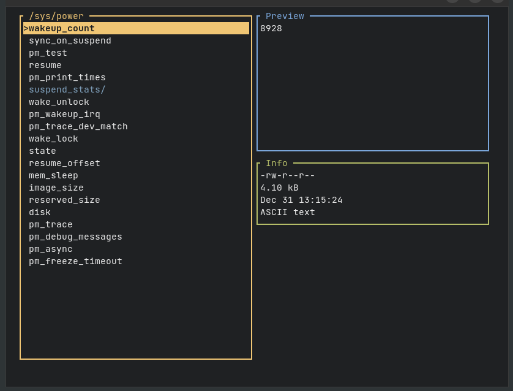

# rufile

## Introduction

`rufile` is a lightweight and fast file manager using a terminal user interface written in [Rust](https://www.rust-lang.org).

Key Features:
- Directory navigation
- File and directory management (creation, deletion, renaming, copying) with vi-like commands
- Permission management
- Display of file metadata
- Viewing file "head" content
- File search functionality
- Customizable color configuration
- Opening files with default applications
